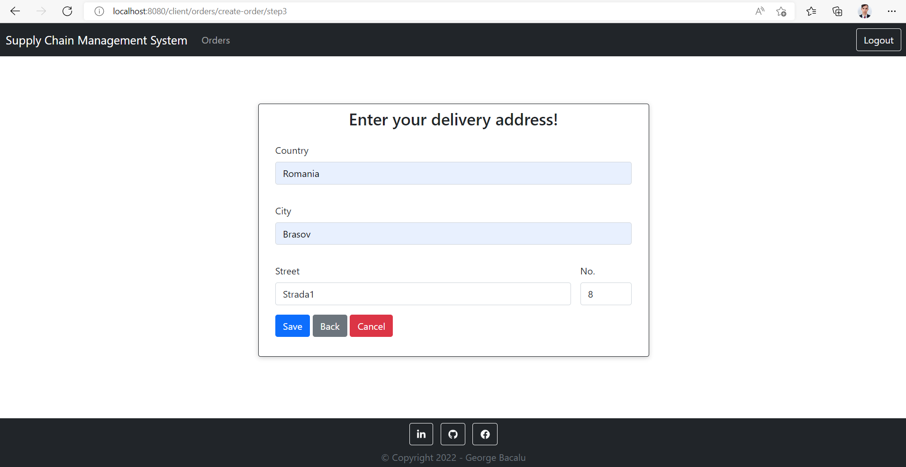

# Supply Chain Management System Project

### About the project:
The **Supply Chain Management System** project represents the starting implementation of the management of business over a network. It includes a whole range of management procedures like
handling, storage and movement of raw materials.

### Technology stack:
* **Programming languages & technologies**: Java, Spring Core, Spring Boot, JUnit
* **IDEs (Integrated Development Environment)**: IntelliJ
* **Databases/Data access providers**: MySQL, H2
* **Build automation tools**: Maven
* **Versioning systems**: Git
* **Web servers**: Tomcat

### Spring modules used:
This project is a simple Spring Boot web application that came into existence after learning and delving into several Spring Boot basic functionalities including:
* **Spring Application Context** - beans management inside the IoC (inversion of control) container
* **Spring AOP (Aspect Oriented Programming)** - powerful tool for separating the cross-cutting concerns from the main business logic
* **Spring Boot Web App** - usage of the MVC (Model-View-Controller) architectural design and Thymeleaf as a template engine
* **Spring Boot REST Services** - provide fronted-backend separation by providing JSON formatted responses to the user's HTTP requests
* **Spring Data Access** - provide data storage using Spring Data JPA (Java Persistence API) and Hibernate framework as an ORM (Object Relational Mapping) implementation
* **Spring Testing** - provide unit tests for increased project flow maintainability
* **Spring Security** - provide authentication and authorization functionality and secure the endpoint

### Project tasks / experience:
* Separate the backend application into 3 layers: repository (data access layer), service (business logic processing layer) and controller (http requests processing layer).
* Use the MVC architecture to create separation between frontend and backend.
* Use Thymeleaf template engine to simplify the process of mapping the requested models to views.
* Configure Spring Security and create a table for storing users in the database, as well as HTML login and register pages to complete the authentication process.
* Expose REST endpoints for performing CRUD operations on the orders of a client
* Create a 3-step order submission form that processes the entered data and assigns the values to the columns in the 'clients' table inside the database.

### Installation and getting started guide:
For every software installed, add the binary folder to the system environment variables, then open the command line and check if the installation was successful by checking the version.
1. Install and configure JDK (Java Development Kit) [https://www.oracle.com/java/technologies/downloads/](https://www.oracle.com/java/technologies/downloads/).
```bash
    java --version
```
2. Install and configure Maven [https://maven.apache.org/download.cgi?Preferred=ftp://ftp.osuosl.org/pub/apache/](https://maven.apache.org/download.cgi?Preferred=ftp://ftp.osuosl.org/pub/apache/).
```bash
    mvn --version
```
3. Install and configure Git [https://git-scm.com/downloads/](https://git-scm.com/downloads/).
```bash
    git --version
```
4. Install and configure MySQL Server and Workbench [https://dev.mysql.com/downloads/mysql/](https://dev.mysql.com/downloads/mysql/).
```bash
    mysql --version
```
5. To clone the project in your local repository, copy the '.git' link inside the code section and choose HTTPS as the cloning method. In the command line type:
```bash
    git clone https://github.com/GeorgeBacalu/supply-chain-management-system-S4J.git
```
6. Install an IDE (Integrated Development Environment) that supports Java to run the application (IntelliJ is preferred)
   [https://www.jetbrains.com/idea/download/?fromIDE=#section=windows](https://www.jetbrains.com/idea/download/?fromIDE=#section=windows)
7. In MySQL Workbench create a new query. Enter and run the following command:
```sql
    CREATE DATABASE supply_chain_management_system;
```
8. Inside the src/main/resources/application.properties modify the password with the one set in the installation wizard:
```properties
  spring.datasource.username = root
  spring.datasource.password = [your-password]
```
9. Execute the application by running the main() method inside src/main/java/com/project/SupplyChainManagementSystemS4JApplication.java. This should activate the Tomcat Container and provide access to http://localhost:8080 and create the tables needed inside the database.

### Backend implementation:
**MVC** is an architectural design which consists of a Model - View - Controller separation that allows one to provide abstraction and loose coupling between the layers in an application:
* **Repository Layer** - provides data access functionality
* **Service Layer** - take data from the data source and provides business logic processing functionality
* **Controller Layer** - process the user's requests by calling the service and returns responses

When the user tries to access a certain page, they must receive resources from the backend/server. The **Dispatcher Servlet** analyzes the endpoint from URI and forwards the request to the
**Controller Layer** for processing (providing information on how that resource should be handled). To render something in the browser it needs data that must be manipulated. This data represents
the model. In the context of Spring Boot it is most likely be a POJO (Plain Old Java Object) that is mapped to a table in a database. Once transformed in the desired shape, these data should be
poured in a view that should be returned to the frontend user via the View Resolver.


### Web Application Flows:
* **Registration Page**: Here, the user has to input the provided fields to create an account. Their credentials are saved in the database and can be accessed for later use.


* **Login Page**: Here, the user has to input the credentials of an existing account. By doing that, they will be redirected to the home page and have access to the secured endpoints available
  for his role (currently admin is the only available role).


* **Home Page**: Here, is the main access point to all the resources.


* **Orders Page**: Here, the user has an organized overview of the history of the placed orders.


* **Products Page**: Here, the user has an organized overview of the history of the products in the placed orders.


* **Customers Page**: Here, the user has an organized overview of the history of the customers that placed the orders.


* **Addresses Page**: Here, the user has an organized overview of the history of the addresses of the customers that placed the orders.


* **Place Order Page**: The user can place an order by completing and submitting a 3-step order form.

    * **Place Order Page (step1)**

  

    * **Place Order Page (step2)**

  

    * **Place Order Page (step3)**

  

* **Saved Order Page**: Once the order is saved the user is redirected back to the Order Page with an alert box that informs the user whether the submission went through or was refused.

